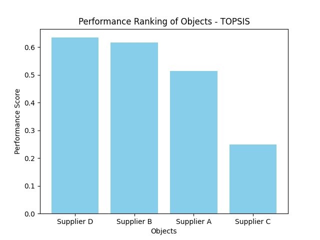

# TOPSIS
### Implementing TOPSIS (Technique for Order Preference by Similarity to Ideal Solution) algorithm with Python and NumPy.

## Context:
TOPSIS is a multi-criteria decision-making method used to determine the best alternative from a set of options/objects by considering their proximity to an ideal solution and their distance from negative ideal solutions in a multi-dimensional space.

- More information about the method can be found at: [TOPSIS - Um Algoritmo de Tomada de Decisão](https://computacaointeligente.com.br/algoritmos/TOPSIS-tomada-de-decisao/)

## Dependencies:
All necessary dependencies are included in `requirements.txt`. To install all of them, perform the following command in your terminal:
```python
pip install -r requirements.txt
```

## How to Run:
After installing all dependecies, beware to be inside directory `topsis/src` to run `main.py` file to avoid errors in the present example.

To run personal examples, make sure to change `input/data.csv` dataset and to correctly attribute criterias ("C" or "B" for Cost or Benefit) and weights in `input/data.json`, accordingly to the attributes in your dataset's columns.

## Results:
In this example, I performed TOPSIS to determine which object Supplier would be better based on the following attributes: "Cost", "Quality", "Delivery Time", "Reliability" and "Environmental Impact".

Here are the results:

- `output/rank.png`:



- `output/rank.txt`:
```text
Ranking:
1. Supplier D -> Score: 0.6339
2. Supplier B -> Score: 0.6167
3. Supplier A -> Score: 0.5140
4. Supplier C -> Score: 0.2485
```


